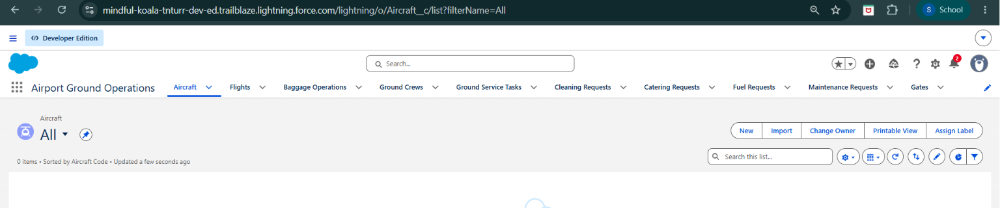

# Day 1 – Business Analysis & Custom Object Design

## Objective

The objective of Day 1 was to understand the airport ground operations business process and design the initial Salesforce data model.

Instead of directly building automation, the project began by identifying the real-world business workflow, stakeholders, operational challenges, and system requirements.

---

## Business Problem

Airport ground operations involve multiple departments such as Gate Management, Ground Crew, Fuel Team, Cleaning Team, Catering Team, and Maintenance Team.

Manual coordination using spreadsheets, phone calls, and emails can result in:

- Flight delays
- Duplicate gate assignments
- Poor communication
- Human errors
- Lack of centralized tracking

---

## Solution

A Salesforce-based Airport Ground Operations Management System was designed to centralize operational data and automate airport workflows.

---

## Custom Objects Created

- Flight
- Aircraft
- Gate
- Ground Crew
- Cleaning Request
- Fuel Request
- Catering Request
- Maintenance Request
- Ground Service Task

---

## Skills Learned

- Business Analysis
- Requirement Gathering
- Salesforce Data Modeling
- Custom Object Creation
- Naming Conventions
- Object Manager

---

## Screenshots

---

## Progress

Day 1 focused on designing the foundation of the project before implementing business logic and automation.
