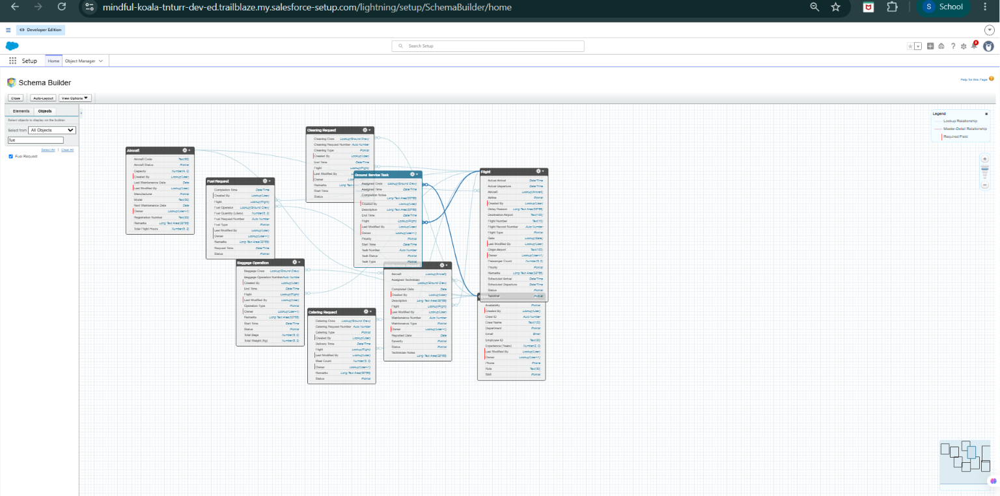

# Day 2 – Data Model & Business Rules

## Objective

The objective of Day 2 was to complete the Salesforce data model by creating custom fields, defining relationships between objects, and implementing validation rules to enforce airport business policies.

---

## Work Completed

### Custom Fields

Created fields for all project objects including:

- Flight
- Aircraft
- Gate
- Ground Crew
- Cleaning Request
- Fuel Request
- Catering Request
- Maintenance Request
- Ground Service Task

---

### Relationships

Implemented Lookup Relationships between business objects to support airport operations while maintaining data integrity.

Examples:

- Flight → Aircraft
- Flight → Gate
- Flight → Ground Crew
- Flight → Cleaning Request
- Flight → Fuel Request
- Flight → Catering Request
- Flight → Maintenance Request

---

### Validation Rules

Implemented business validations such as:

- Departure must be after Arrival
- Gate required before Departure
- Passenger count validation
- Fuel quantity validation
- Meal count validation
- Maintenance priority validation

---

## Skills Learned

- Custom Fields
- Lookup Relationships
- Data Integrity
- Validation Rules
- Salesforce Formula Language

---

## Screenshots

---

## Progress

Day 2 completed the core data model and established the business rules required before implementing automation.
